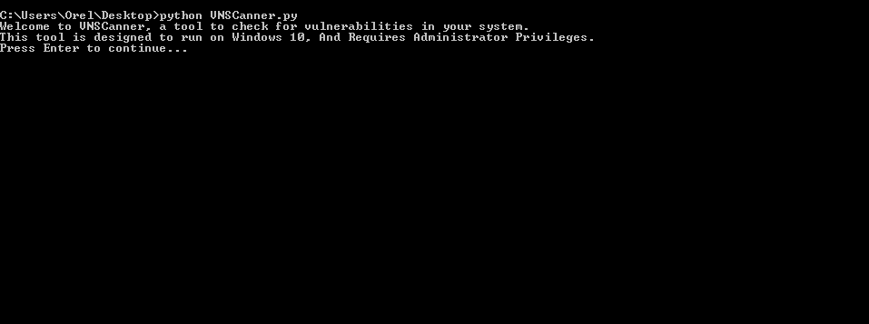
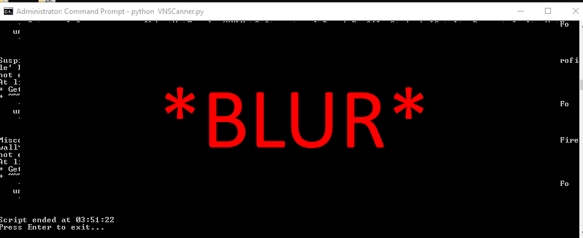

<h2>About the Script:</h2>

This script requires a Windows 10 system with administrator privileges and the Python interpreter to run. It is best suited for performing vulnerability checks on a single system, as it uses a combination of built-in libraries and command-line tools to check for updates, scan for viruses and malware, and check for vulnerabilities.
One of the strengths of this script is its use of the "sfc /scannow" command to check for vulnerabilities, which is a system utility provided by Windows that scans all protected system files and replaces any incorrect versions with correct versions.
Additionally, the script has optional functionality to check for open ports and system logs, which can provide further information about potential vulnerabilities on the system. This optional functionality can be enabled by uncommenting the relevant lines of code. Overall, this script is a useful tool for quickly and efficiently checking for vulnerabilities on a Windows 10 system.

<b>In one line : This script is a Python-based vulnerability scanner for Windows 10 systems that uses a combination of built-in libraries and command-line tools to check for updates, scan for viruses and malware, check for vulnerabilities, retrieve system information, and optionally check for open ports and system logs.</b>

<h2>Created By Orel Mizrahi Adani</h2>

Useful Links:
Download Python : https://www.python.org/
Linkedin : https://www.linkedin.com/in/orelmizrahiadani/
Github : https://github.com/orelmizrahii

